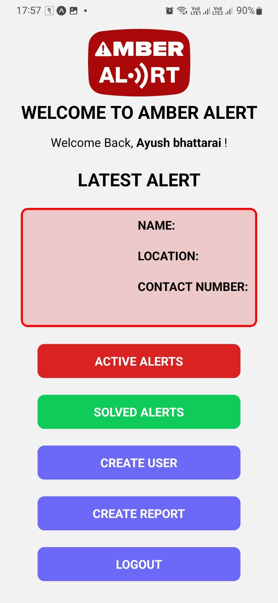

# Amber Alert System using Random Forest Algorithm

## Introduction

Proof of concept application that was created as the semester project for the Bsc.CSIT 7th semester.
This project is an attempt to create a missing persons alert system. Since the project was inspired by the existing amber alert system we decided to keep the project name same.

## Screenshots

Following are some screenshots of the project:\
<table>
  <tr>
    <th>Guest (no-login) home</th>
    <th>Admin home</th>
    <th>User creation form</th>
    <th>Case creation form</th>
  </tr>
  <tr>
    <td></td>
    <td></td>
    <td></td>
    <td></td>
  </tr>
</table>

## Project Contributors

-   Ayush Bhattarai
-   Dewanand Giri
-   Prabal Aryal
